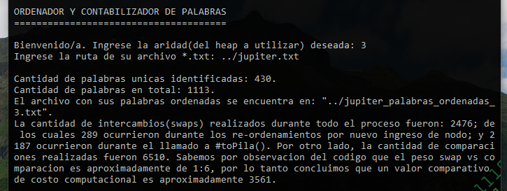

# words_counter_and_sorter (project #2)

N-ary heap-tree implementation to count and sort words from certain *.txt file.

### Demo

### Note

The code, as opposed to the globally recommended style, is in Spanish due to educational purposes, as a request from the AyED subject of our university.
